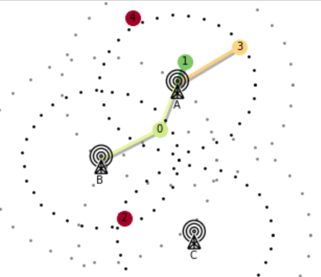
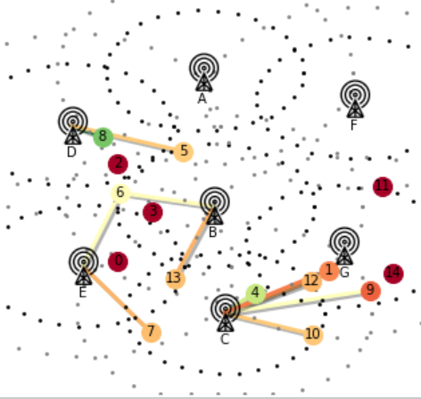
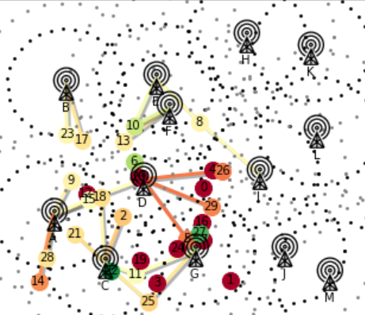

(components)=

# Modules

## Simulation

The [base environment](https://mobile-env.readthedocs.io/en/latest/source/mobile_env.core.html#mobile_env.core.base.MComCore) class simulates cell assignment of many user equipments (UEs) to possibly multiple basestations (BSs) in a mobile communication setting. Our simulation is mainly composed of five components that implement their functionality in a replacable manner:

1. [Channel](https://mobile-env.readthedocs.io/en/latest/source/mobile_env.core.html#mobile_env.core.channels.Channel): computes the data rate of connections among UEs and BSs.
2. [Arrival](https://mobile-env.readthedocs.io/en/latest/source/mobile_env.core.html#mobile_env.core.arrival.Arrival): specifies the arrival and departure times of UEs, i.e., defines when and how long UEs request service.
3. [Movement](https://mobile-env.readthedocs.io/en/latest/source/mobile_env.core.html#mobile_env.core.movement.Movement): model to define the movement patterns of UEs. 
4. [Schedule](https://mobile-env.readthedocs.io/en/latest/source/mobile_env.core.html#mobile_env.core.schedules.Scheduler): defines how BSs multiplex resources among all connected UEs.
5. [Utility Function](https://mobile-env.readthedocs.io/en/latest/source/mobile_env.core.html#mobile_env.core.utilities.Utility): defines a function that quantifies the quality of experience (QoE) of UEs dependend on their (macro) data rate.

All components are called according to the *strategy pattern*, i.e., they define a fixed set of methods invoked by the base environment. This improves the configurability and extendability of our project. For example, if we would like to change the simulation's default movement pattern so that a selectable UE doesn't move at all, it can be implemented as follows:
```python
from mobile_env.core.movement import RandomWaypointMovement

class LazyUEMovement(RandomWaypointMovement):
    def __init__(self, lazy_ue, **kwargs):
        super().__init__(**kwargs)
        # this UE doen't move!
        self.lazy_ue = lazy_ue
        
    def move(self, ue):
        """Overrides default movement pattern."""
        # do not move lazy UE!
        if ue.ue_id == self.lazy_ue:
            return ue.x, ue.y
        
        # default movement otherwise
        return super().move(ue)


from mobile_env.core.base import MComCore

# replace default movement in configuration 
config = MComCore.default_config()
config['movement'] = LazyUEMovement
# pass init parameters to custom movement class!
config['movement_params'].update({'lazy_ue': 3})

# create environment with lazy UE!
env = gym.make('mobile-small-central-v0', config=config)
```

This example demonstrates that each core component can be replaced **without changing source code**. It also shows that we can pass parameters to the components' initialization via the ``config`` dictionary. Adapting the channel model, etc., works similarly. For example, replacing the default [Okumura–Hata](https://en.wikipedia.org/wiki/Hata_model) channel model by a (simplified) path loss model can be as easy as this:

```
import numpy as np
from mobile_env.core.base import MComCore
from mobile_env.core.channel import Channel


class PathLoss(Channel):
    def __init__(self, gamma, **kwargs):
        super().__init__(**kwargs)
        # path loss exponent
        self.gamma = gamma

    def power_loss(self, bs, ue):
        """Computes power loss between BS and UE."""
        dist = bs.point.distance(ue.point)
        loss = 10 * self.gamma * np.log10(4 * np.pi * dist * bs.frequency)
        return loss


# replace default channel model in configuration 
config = MComCore.default_config()
config['channel'] = PathLoss

# pass init parameters to custom channel class!
config['channel_params'].update({'gamma': 2.0})

# create environment with custom channel model
env = gym.make('mobile-small-central-v0', config=config)
...
```

## Handlers
Handler classes implement the interface methods and properties for OpenAI Gym. While the core simulation implements the base cell assignment functionality, the handler class implements how agents may interact with it. In other words, it defines whether environment provides a multi-agent or centralized interface, what actions are expected and what observations and rewards are returned as feedback. To do so, the handler must at least implement the following (class)methods: `observation_space`, `action_space`, `action`, `observation` and `reward`. The handler class is passed to the simulation within the configuration. The core simulation calls its methods according to the *strategy pattern*.

An example for passing a custom handler to the environment:
```python
class CustomHandler(Handler):
    @classmethod
    def action_space(cls, env):
        ...

    @classmethod
    def observation_space(cls, env):
        ...

    @classmethod
    def action(cls, env, action):
        ...

    @classmethod
    def observation(cls, env):
        ...

    @classmethod
    def reward(cls, env):
        ...

config = {'handler': CustomHandler}
env = gym.make('mobile-small-central-v0', config=config)
```

So far, [mobile-env](https://mobile-env.readthedocs.io/en/latest/index.html) implements handlers for a multi-agent and centralized control setting.

## Scenarios
So far, mobile-env provides three simulation environments from small to large! They mostly differ in terms of the number of basestations and user equipments.

Small Size             |  Medium Size             |  Large Size             
:-------------------------:|:-------------------------:|:-------------------------:
  |    |  

## Wrappers
Wrapper classes are used to make interfaces compatible with other libraries if they aren't already. For example, the multi-agent reinforcement learning libraries [RLlib](https://docs.ray.io/en/stable/rllib.html) and [PettingZoo](https://www.pettingzoo.ml/) expect different interfaces. So far, we only provide a wrapper class for RLlib's MultiAgentEnv, so that RLlib's multi-agent algorithms can be used to train on mobile-env!. 

Example usage of our **RLlibMAWrapper** class:
```python
from mobile_env.wrappers.multi_agent import RLlibMAWrapper

env = gym.make('mobile-small-ma-v0')
# wrap multi-agent env for RLlib compatibility
env = RLlibMAWrapper(env)
# use RLlib to train on the environment ...
...
```